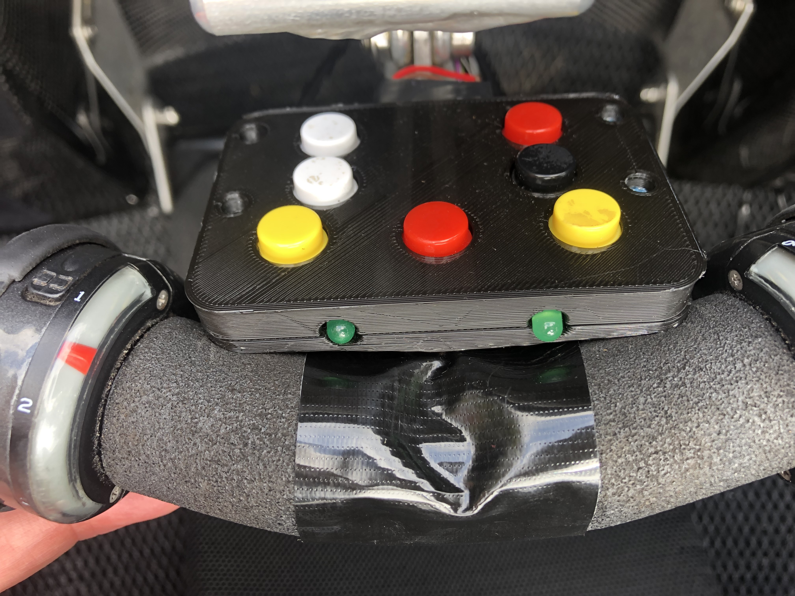
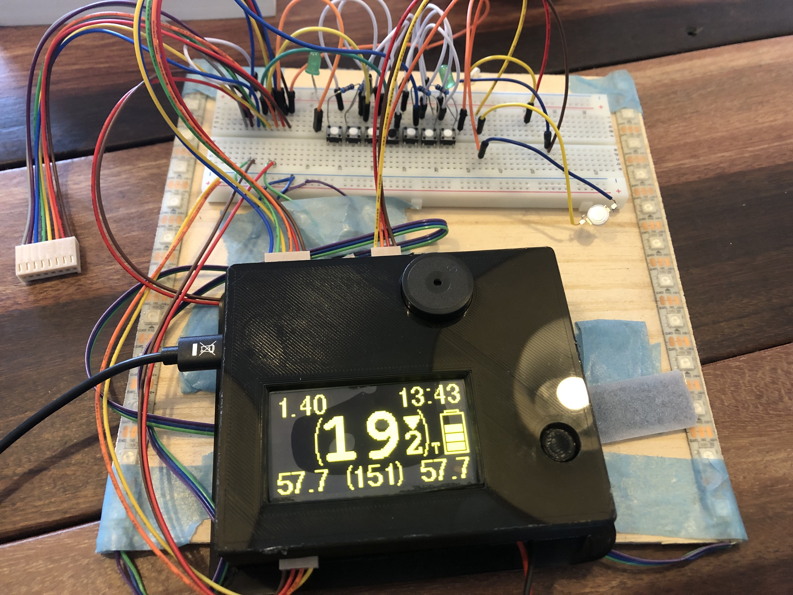

# Velo Dashboard

A bicycle computer made for velomobiles.

Walkthrough videos (dutch):
- https://www.youtube.com/watch?v=hqzajXb8Hd0 (inside velomobile)
- https://www.youtube.com/watch?v=B8IcSTC7h3M (test setup)

## Reasons

In the summer of 2022 i bought a second hand [Quest](https://www.velomobiel.nl/quest/) velomobile.
It was in very good shape, had only driven 8000km while only 10 years old, and it fits my budget.

But it was missing blinkers, had a 6V system on board, and two headlights which could be turned on independent from eachother. Which results in my Quest looking cross-eyed :-(
That could be done better.

I also struggled finding the 'perfect' bicycle computer to keep track of at least my current speed, average speed, maximum speed, time, time of the trip, distance, and at least two seperate distance counters.
The most anoying things of these computers are the small screens, the not so ideal combination of functions, button combo's etc. And a GPS one took too long to recognise my location (possibly due to the carbon body).

I took some inspiration found online from other velonauts. Such as:
- [VeloPuter](https://veloputer.wordpress.com/about/)
- [Arduino in VM](https://quest.robbroek.nl/search/label/arduino)
- [Velomobiel Led strip verlichting](https://bickyenzijnfietsen.blogspot.com/2018/10/velomobiel-led-strip-verlichting.html)

## Features

This bicycle computer for a velomibile has these features:

Lighting:
- Drive the normal LED lights that are standard in most velombiles (rear light, brake light, fog light and blinkers if present)
- Drive the (double) head light(s) in several steps (off, dim, normal, beam)
- Drive LED strips on each side of the velomobile. For blinkers (with nice animation!), and normal light for visibility (front, rear and brake lights).

Knobs & Display:
- Big OLED display so i can see it easy.
- All controls are on the steering wheel (with a 3D printed console).
- Knobs for the blinkers, lights and switching through several pages on the display.

Speed & Distance:
- Current speed
- Current average speed
- Current maximum speed
- Distance of current trip
- Total distance of current day
- Distance of previous day
- Average and maximum speed of previous day
- Total distance of the velomobile in total
- Total distance of the velomobile while in my ownership
- At least three different tocal counters wich can be reset independent

Time:
- Current clock time
- Driving time of current trip (excluding stops for traffic lights etc)
- Total time of current trip (including these stops)
- Driving and total time of previous day

Others:
- Current Cadans speed
- Battery status
- Battery saving modes
- Automatic turn off after a set time (to spare battery)
- Option to set the total distance
- Option to set the clock time
- Option to set the wheel circumference
- Optionts to reset all extra counters

# Result

I have a working prototype since december 2022, with several improvements and new featuers since then.

# Manual

## Dashboard

- The yellow buttons are for activating the blinkers. Press and it turns on. Press again to turn off. Press the other and the first one stops and the new one starts. The LED's in front of the dashboard reflects the state of the blinkers.
- The white buttons are for controlling the head and rear lights. And also the lights of the LEDstrips. Press the upper button increases intensity. The lower button decreases intensity. These modes exists: OFF, DIMLIGHT, NORMAL LIGHT, BEAM, FOG.
- The red button on the upper right turns the headlights into BEAM mode while pressed.
- The red button in the middle is not part of the computer: it is it's own circuit and turns of the horn (in my case a Hornitt).
- The black button on the right is for controlling the display on the computer. Pressing cycles to several pages of the display (see below). Long press turns the computer and display into SETUP mode (see below).

## Display modes

Normal pages of the display (cycles through with the blank button):

### Homescreen:
- Speed (big in the center)
- Current distance (topleft)
- Current clock time (topright)
- Average speed (bottomleft)
- Maximun speed (bottomright)
- Cadans / RPM (bottomcenter)
- Icons for headlights and rearligt (middleleft)
- Icons for blinkers and breaklight (topmiddle)
- Icon for battery status (middleright)

### Screen 2 (today):
- Average speed
- Max speed
- Time elapsed while driving (excluding stops)
- Time elapsed from start of driving (including stops)

### Screen 3 (distances):
- Distance of current drive
- Distance of today
- Distance of previous driving day
- Distance of Trip 1

### Screen 3 (totals):
- Total distance of velomobile in my ownershop
- Total distance of velomobile
- Distance of Trip 2
- Distance of Trip 3

## Setup

A long press on the blank button switches to the setup screens. And pressing normal cycles to the setup screens. Long pressing again switches to normal screens. Of the screens there is some help of how to setup the several options.

These are the setup pages:

- Trip - for resetting Trip 1,2 and 3.
- Clock - for setting the time
- Tyre -  for setting the tyre (used for measuring speed and distances). You can select and ERTRO value or in mm.
- Bike - setting the total distance of the bike.

## Others

The computer keeps track of battery status. If the battery is becoming low it will decreases the brightness of the LEDstrips the battery icon on the display starts to blink.

If the battery is very low/almost dead, it will spare itself by turning everything off.

If you forgot to switch the computer off, if will auto power off after three minutes. The last 20 seconds will be shown in the display. If you press a button or start cycling again, the auto-power-off timer will stop.

## Hardware

### Teensy 4.0

The computer is based around a [Teensy 4.0](https://www.pjrc.com/store/teensy40.html). My first attempt was made with a Arduino nano, which is cheaper and uses less power. But i wanted a clock. And the combination of driving LED strips and having an OLED screen was impossible (as far as i know) with te Arduino. The Teensy 4.0 has multiple i2c (OLED) and interrupts. And it also has a build in RTC (Real Time Clock) with power options for a small coin battery to keep the state of the clock. The Teensy has also lots of room for improvements or future additions (SD card storage for example).

### IP67 LEDstrips WS2812B

IP67 means rainproof. And WS2812B means it just has three wires to connect (5V, GND & Data). I have two of them, one for each side of the velomobile. But the computer can also run four of them in case you want four small ones instead of two large ones. I choose the large ones because of easier assembling on my Quest. Downside is it user more power.
Here is a guide for using [WS2812B LEDstrips](https://randomnerdtutorials.com/guide-for-ws2812b-addressable-rgb-led-strip-with-arduino/)

### Power

- For power i choose Lipo batteries of 12.6 Volts. Other batteries are possible.
- [Polo Mini Pushbutton Power Switch](https://www.pololu.com/product/2809) is a on/off switch, whith reverse protection and more.
- Power regulator to 5V. The Teensy has it's own regulator for 5V to 3.3V.

### LED drivers

For driving the front, rear, brake (and maybe blinker) LED's i use [Meanwell LDD Led drivers](https://www.meanwell.com/webapp/product/search.aspx?prod=LDD-L) (LDD-700 for now).

## Schematics

The raw schematics can be found in the [kicad folder](./kicad)

## Software

For developing i used [VScode](https://code.visualstudio.com/) with [PlatformIO](https://platformio.org/). Once setup, i found this much easier for developling compared the Arduino IDE. But thats a software developer speaking ;-)

## 3D print

A STL file for 3D printing the console can be found in the [3D folder](./3d).
